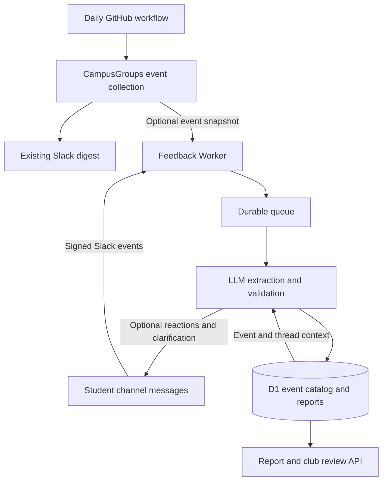

# Slack food feedback

Students can post ordinary text in the existing food channel or reply in a thread.
The listener uses an LLM to extract observations, then stores them alongside the daily
CampusGroups event catalog. No form, separate website, or slash command is required.
The existing incoming webhook can keep posting the daily digest unchanged.

## Architecture



The feedback Worker is a separate deployment from `watchdog/`, in the same repository
and optionally the same Cloudflare account. It does not receive Northwestern credentials,
the Slack incoming webhook, or the watchdog's GitHub token.

## What is captured

- Event/club names reported by students, plus an independently matched CampusGroups event.
- Food available, none seen, food already gone, or unknown.
- Inside/outside the event room, other location, and literal room/location text.
- Literal quantity wording, food types, vendor reported, and vendor inferred separately.
- Literal observation time (if stated), separately from the message's UTC timestamp.
- Reporter-stated access details; these are observations, not permission to enter/take food.
- Source message, evidence quote, thread references, model name, and match confidence.

An event match is accepted only when the model supplies a known event ID/date with high
confidence. Medium/low matches remain unresolved. Matched events omitted from the morning
food filter have `missed_by_digest=true`; this may reflect the lunch window, not a bug.
An event absent from the entire catalog remains an unmatched report for review.
Questions/chatter should produce no reports. All accepted-channel human text is evaluated;
there is no keyword filter that could silently miss unusual food names.

Only text is supported; images/attachments are not analyzed. Bot posts, join/system messages,
other channels/workspaces, and reactions are not ingested. There is no historical backfill.
Context is limited to up to eight previously processed human messages in the same thread
and up to 200 events nearest the message's Chicago date within the previous seven days
and the following day. An event outside that window remains unmatched.

## Activate after merging

Merging adds code, not an active listener. You need a Cloudflare account with Workers,
D1 and Queues available, a Slack app installed in the food workspace, and an OpenAI API
project/key with access to a Structured Outputs model. `OPENAI_MODEL` defaults to
`gpt-4.1-mini` and is configurable. ChatGPT subscriptions do not supply an API key.

1. In the Slack app currently associated with the digest webhook, add a bot user and
   Events API support if you control that app. Otherwise create an app from the included
   `slack-app-manifest.json`. Replace its placeholder Request URL after deployment.
   For a **public channel**, use the bot `channels:history` scope and `message.channels`
   subscription. For a **private channel**, use `groups:history` and `message.groups`
   instead. Optional acknowledgements need `reactions:write` and `chat:write`.
   Reinstall the app after scope changes and invite its bot to the food channel.
   Do not replace or revoke the existing posting webhook.
2. Record the workspace and channel IDs in `wrangler.toml`. The service deliberately
   accepts messages from exactly that pair, even if the Slack app has broader scopes.
3. With Node.js and Wrangler, provision the database and queues:

   ```bash
   cd feedback
   npx wrangler login
   npx wrangler d1 create campusgroups-food-feedback
   # Copy the returned database_id into wrangler.toml.
   npx wrangler queues create campusgroups-food-feedback
   npx wrangler queues create campusgroups-food-feedback-dead-letter
   npx wrangler d1 migrations apply campusgroups-food-feedback --remote
   ```

4. Set secrets through the secret prompts, never source control or chat:

   ```bash
   npx wrangler secret put SLACK_SIGNING_SECRET
   npx wrangler secret put OPENAI_API_KEY
   npx wrangler secret put FEEDBACK_API_TOKEN
   # Required only if acknowledgements are enabled:
   npx wrangler secret put SLACK_BOT_TOKEN
   npx wrangler deploy
   ```

   Generate a long random `FEEDBACK_API_TOKEN` and retain it securely. The same token
   protects catalog uploads and report review; keep it limited to maintainers.
5. Set Slack's Events Request URL to the deployed HTTPS URL plus `/slack/events`.
   Complete Slack's signed URL verification, enable the selected bot subscription,
   and ensure the app is installed/invited. This grants the app access to channel text;
   tell channel members that food observations will be processed by an LLM.
6. Add **optional GitHub repository secrets** `FEEDBACK_API_URL` (Worker origin, no
   `/api/events` suffix) and `FEEDBACK_API_TOKEN`. Future successful daily sends upload
   all date-matching event candidates, including events filtered out of the digest.
   Upload errors log a warning and never prevent Slack delivery.
7. To seed context for a date already delivered, use the context-only CLI with local
   Northwestern credentials and feedback configuration:

   ```bash
   python campusgroups_food_digest.py --date 2026-10-06 --publish-feedback-context
   ```

   Run this from the repository root. It collects/uploads context without posting to
   Slack. It fails visibly if the requested upload is not configured or fails. Do not
   clear a delivery receipt or send a duplicate digest to seed context.

## Review before enabling bot replies

Keep `SLACK_ACKNOWLEDGEMENTS="false"` initially. Send a few real observations in the
configured channel and inspect the protected API:

- `GET /api/reports?date=YYYY-MM-DD`: matched reports for the event date, plus unresolved
  reports posted on that Chicago date. Includes original text and parsed report.
- `GET /api/clubs`: distinct reported-event counts, food observed/none seen/ran out,
  missed-food events, and food-type counts by canonical club.

Both require `Authorization: Bearer <FEEDBACK_API_TOKEN>`. These routes return student
messages: do not expose the token or paste API responses into public GitHub issues.
After checking extraction on real messages, change acknowledgements to `true` and deploy.
The bot adds a check reaction for matched reports or eyes for unresolved ones. On a new
unresolved message it asks for an event name/link in the thread. A later answer can create
a newly matched report using prior thread context; the original unresolved record remains
available for review. Only the matched observation contributes to club summaries.
Acknowledgements are best effort after storage, and are not retried on duplicate deliveries.
They acknowledge capture, not factual verification.

## Reliability, corrections and limits

Slack signatures are checked against the raw body with a five-minute replay window.
The HTTP handler awaits durable enqueue and returns before LLM work; enqueue failure
returns 503 for Slack to retry. Queue redelivery is deduplicated by Slack event ID.
LLM failures/refusals, incomplete output, invalid schema/evidence/event IDs, or database
failures retry three times, then go to the dead-letter queue. Monitor that queue and
`processing-failed`/`slack-ack-failed` logs. Do not attach an automatic dead-letter
consumer until its replay behavior is reviewed. A queue consumer concurrency of **one**
is required for ordered read/check/write handling; do not increase it without a lease.

Message revisions are ordered by Slack timestamps. Editing replaces that message's
reports; deletion blanks its stored text and removes its reports. Edits/deletions also
invalidate derived reports whose saved thread references include that source, rather
than leaving stale club counts. They are not automatically re-extracted. Older revisions
cannot resurrect a deleted message. Reports committed before a lost queue acknowledgement
are not counted twice.

The schema validates format and source evidence, not factual accuracy. Model confidence
is not calibrated probability. Review unmatched reports, contradictory observations,
and inferred vendors. `none_seen` is not proof that an event never provided food.
Multiple reports of one event count once per summary category, and conflicting categories
can both include that event. Food labels receive basic lowercase/whitespace normalization,
not a learned taxonomy. Club summaries reflect voluntarily reported events, not all events,
so they must not yet be advertised as probabilities or used to automatically change food
filtering. The PR builds the evidence collection/review foundation; automatic predictions
and modifications to daily recommendations are future changes.

Source text is retained in D1 until deleted/removed by a maintainer; there is no automatic
retention schedule. Only allowed-channel message text, bounded thread context and event
metadata go to OpenAI; author IDs and attachments are not sent. Requests use `store:false`,
which does not itself change the API project's provider retention policy. Configure that
policy and storage retention appropriately before rollout. Logs contain event IDs, counts,
model/token usage and error types, not message text or secret values.

The existing digest can run with no feedback credentials. Feedback deployment is also
independent of deploying the morning fallback.

## Tests

From the repository root:

```bash
python -m unittest discover -s tests -v
node --test watchdog/worker.test.mjs feedback/*.test.mjs
```

Worker SQL tests run the actual migration/queries against temporary SQLite databases.
LLM/Slack HTTP calls are mocked; these tests do not validate extraction quality, actual
Slack permissions, or a live Cloudflare deployment. A real end-to-end activation test is
required after setting the secrets and event subscription.

References: [Slack Events API](https://docs.slack.dev/apis/events-api/),
[Slack request verification](https://docs.slack.dev/authentication/verifying-requests-from-slack/),
[OpenAI Structured Outputs](https://developers.openai.com/api/docs/guides/structured-outputs),
[Cloudflare queue retries](https://developers.cloudflare.com/queues/configuration/batching-retries/).
